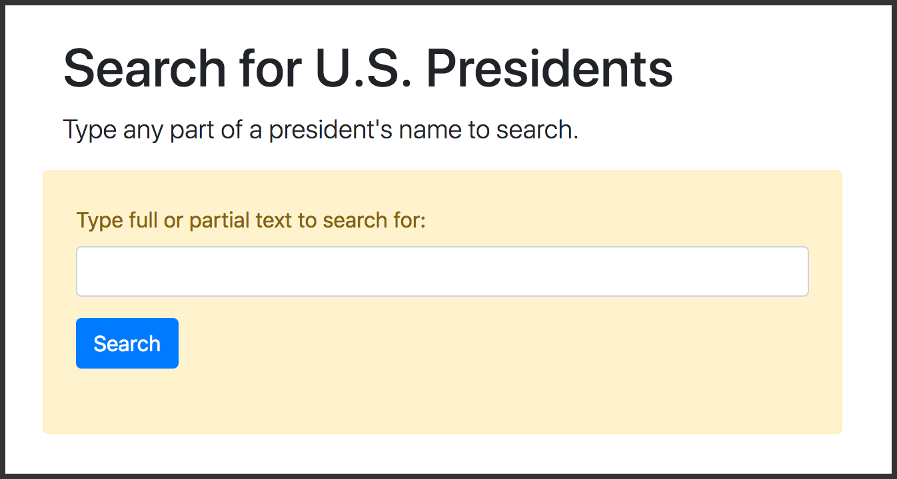

# Search-Form Exercise with Flask

For this exercise, you will need the following **installed** in a Python 3.x virtual environment:

* Flask
* Flask-WTF
* Flask-Bootstrap4

## Table of Contents

* [Get started](#get-started)
* [Examine the search-page template](#examine-the-search-page-template)
* [Make changes to the Flask app](#make-changes-to-the-flask-app)
   * [Add more import statements](#add-more-import-statements)
   * [Add a secret key and the Bootstrap function](#add-a-secret-key-and-the-bootstrap-function)
   * [Create a new form class](#create-a-new-form-class)
   * [Write a new route function](#write-a-new-route-function)
   * [What does the function do, so far?](#what-does-the-function-do-so-far)
   * [Make the search work](#make-the-search-work)
   * [Determine what will be returned](#determine-what-will-be-returned)
   * [Three different return statements](#three-different-return-statements)
* [Conclusion](#conclusion)
* [Version Using a Select Menu in the Form](#version-using-a-select-menu-in-the-form)

This exercise *builds on* [a previous one](https://github.com/macloo/flask-exercise), in which a Flask app read a CSV file with data about 45 U.S. presidents and built a separate page for each of them. Here, we begin with a completed version of that exercise.

In that earlier exercise, the CSV was converted into a list of Python dictionaries. From that list, an index page was generated. On the index page, all the presidents' names appeared as links. Click a name to open a page about that president. [Try it here.](https://weimergeeks.com/flask_pres/)

In THIS exercise, we will add a **search page** so that a user can type all or part of any president's name and get either a president's page (if only one match is found) or a list of matching presidents.

## Get started

**1. DOWNLOAD THE ZIPPED VERSION OF THIS REPO to follow along in class.**

**2. UNZIP it and drag the folder flask-pres-forms-exercise-master into the folder that contains your virtualenv for Flask projects.**

**3. ACTIVATE your virtualenv.**

**4. All files are in:** *final_app*

**5. Our Flask app file (to be edited) is:** *presidents.py* **Open it in Atom.**

**6. Our new template (no changes needed) is** *search.html* **Open it in Atom too.**

[These instructions are on a slide to show in the classroom.](https://docs.google.com/presentation/d/1zggsJNcq2BHtVM_Q9_4u6oVm0jsGCx3WjAaJ5_vUMvA/edit?usp=sharing)

## Examine the search-page template

Look at the template in Atom. The top lines are all Jinja2 directives.

```html




Search for Presidents




```

Previously, we used a *base.html* template in the *templates* folder. Now, however, we are using a Bootstrap base template that was installed along with **Flask-Bootstrap4**.

We're *also* importing a Bootstrap form template used by **Flask-WTF**.

We're writing a new HTML TITLE into the Bootstrap template with a Jinja2 `block` directive. After that, we open a familiar Jinja2 `block` directive for the main HTML content.

```html
<div class="container">
	<div class="row">
		<div class="col-xl-12">

			<h1 class="mt-5">Search for U.S. Presidents</h1>

			<p class="lead">Type any part of a president's name to search.</p>

		</div>
	</div>
```

Nothing special there if you've used Bootstrap styles before. We open a `container` DIV, create a row and a column, and write an H1 and a P. Close the column DIV. Close the row DIV.

```html
<div class="row">
    <div class="col-lg-8 col-md-10 col-sm-12 alert alert-warning p-4">

        {{ wtf.quick_form(form) }}

        <p class="mt-4"><strong>{{ message }}</strong></p>

    </div>
</div>
</div>
```

Now we have a new row, also with just one column, and inside that column we have two things:

1. A complete Bootstrap-formatted form, generated by one directive: `{{ wtf.quick_form(form) }}`

2. A placeholder, `{{ message }}`, that will be filled in by our Flask app when no matching president was found. Otherwise, it remains empty.

In the Flask app, we will write Python code to make those two things work.

```html

```

Don't forget to close the `block` that was opened with ``.

## Make changes to the Flask app

### Add more import statements

The app file to be modified is *presidents.py*, and it begins with imports, as usual for Flask:

```python
from flask import Flask, render_template
from modules import convert_to_dict, make_ordinal
```

**ACTION 1: Replace those two lines with the following lines.**

```python
from flask import Flask, render_template, redirect, url_for, request
from modules import convert_to_dict, make_ordinal

from flask_bootstrap import Bootstrap
from flask_wtf import FlaskForm
from wtforms import StringField, SubmitField
from wtforms.validators import Required
```

Those are explained in [Part 4: Forms in Flask](https://github.com/macloo/python-beginners/tree/master/flask/part4_forms). Basically we are importing Bootstrap and all the things needed for the form.

### Add a secret key and the Bootstrap function

**ACTION 2:** *Below* `app = Flask(__name__)`, add the following:

```python
# Flask-WTF requires an encryption key - the string can be anything
app.config['SECRET_KEY'] = 'C2HWGVoMGfNTBsrYQg8EcMrdTimkZfAb'

# Flask-Bootstrap requires this line
Bootstrap(app)
```

Those are also explained in [Part 4: Forms in Flask](https://github.com/macloo/python-beginners/tree/master/flask/part4_forms). The secret key is for form data security, and the `Bootstrap(app)` function gives the Flask app access to Bootstrap styles, which will be used by Flask-WTF, and which are already written into the template we examined, above.

### Create a new form class

**ACTION 3:** *Below* `presidents_list = convert_to_dict("presidents.csv")`, add the following:

```python
# create a class for the form
class SearchForm(FlaskForm):
    text = StringField('Type full or partial text to search for:', validators=[Required()] )
    submit = SubmitField('Search')
```

This is essential for creating a form with Flask-WTF. The form's controls are created as properties of a new Python class, named `SearchForm` in this case. We imported `StringField` because we will need an `<input type="text">` form control, and we imported `SubmitField` because we will need an `<input type="submit">` form control.

In our route function, coming up soon, you'll see how the variable `text` is used to get the user's input out of the submitted form so Python can use it.

You won't see `submit` used again, but Flask-WTF needs it to create a working Submit button in the form in *search.html*.

Keep in mind that if you want to include other kinds of form controls, you'll need to import them `from wtforms`. (Example: `<input type="radio">` requires `RadioField`.)

Note, you'll also see `SearchForm` in the code coming up below.



### Write a new route function

This app has two route functions now, and we will add a third to handle searches. It will work with the *search.html* template.

**ACTION 4:** Find these two lines at the bottom of the app file. ABOVE THEM, add some empty lines for the new route function.

```python
# keep this as is
if __name__ == '__main__':
    app.run(debug=True)
```

**ACTION 5:** In that space you just opened up, start the new route like this:

```python
# third route

@app.route( '/search', methods=['GET', 'POST'] )
def search():
    form = SearchForm()
    message = ""
    return render_template('search.html', form=form, message=message)
```

It's not done yet, but this will allow us to test the template.

**ACTION 6:** At the bash prompt (`$`), with your virtualenv **activated**, run the app with `python presidents.py`

Now go to `localhost:5000/search` and see what you've got.

### What does the function do, so far?

You have a nice form, created by Flask and your template &mdash; but it doesn't *do anything* yet. We need to add some Python stuff to the route function.

We're going to discuss `GET` and `POST` in a moment, but first let's look at the two lines above the `return` statement. The line that begins with `form =` creates a new variable to be *passed to the template*. Look at the `return` statement. That is where the value of `form` is sent to the template. Without this, you don't have a form.

What is the *value* of `form` when the template receives it?

The *value* of `form` is `SearchForm()` &mdash; the class you built, with `StringField` and `SubmitField` in it. *That* **class** and *this* **variable** are what made the form appear on the page in the browser.

The variable `message` is also passed to the template in the `return` statement. For now, it's empty. It will only be filled if the search is a failure, in which case we'll use the message to tell the user that.

### Make the search work

You might remember that servers and web browsers do a little dance together that we call *request/response*. The browser requests, and the server responds. The usual request for an HTML page is a `GET` request. When a form sends data to a server, it's usually with a `POST` request. `POST` is saying, "I have some data here, attached to this request."

We want to run our search route via *both kinds of request*, because we want to open it with no data (the way you just did), and we *also* want to process the data submitted by the form *with the same route function* &mdash; and that means `POST`.

```python
if request.method == "POST":
    # get the input from the form
    text = request.form.get("text")
```

**ACTION 7:** Add those lines after `message = ""` and above the `return` statement.

When a user **submits the form** (`POST`), now we have whatever she typed in the text-input box. We have it in the variable named `text`.

We need to compare that string to each president's name and determine whether the string can be found in the name, or not. Do something to *every president in the list*? That calls for a loop!

```python
# loop to find ALL presidents who match inputs
# but ONLY those who match
for president in presidents_list:
    if text.lower() in president['President'].lower():
        ids_list.append(president['Presidency'])
        name_list.append(president['President'])
```

**ACTION 8:** Add those lines above the `return` statement.

We're stealing some stuff from another route function, `index()` &mdash; the one that makes a list of all the presidents in the original app (where there was no search function). We need to make a list here too, because if the user searches for a string like `James`, she's going to get *more than one* president.

Let's leap forward a little and show the function with some other bits stolen from the `index()` function:

```python
@app.route( '/search', methods=['GET', 'POST'] )
def search():
    form = SearchForm()
    message = ""

    # make three empty lists
    ids_list = []
    name_list = []
    pairs_list = []

    if request.method == "POST":
        # get the inputs from the form
        text = request.form.get("text")

        # loop to find ALL presidents who match inputs
        # but ONLY those who match
        for president in presidents_list:
            if text.lower() in president['President'].lower():
                ids_list.append(president['Presidency'])
                name_list.append(president['President'])

        pairs_list = zip(ids_list, name_list)

    # some more code will go here

    return render_template('search.html', form=form, message=message)
```

**ACTION 9: Edit or replace your route function to match what you see above.**

The main idea you should understand here is that *IF* the form was submitted:

* The function takes what the user typed (as `text`),
* Loops over the list of all the president dictionaries,
* Looks at each president's name and
* Determines whether the value of `text` is *in* that name. (Note, we lowercase, with `.lower()`, both the user input and the president's name in the search so that uppercase letters don't cause a no-match.)
* If a match is found,
* The president's "Presidency" number is appended to `ids_list`, and
* The president's name ("President") is appended to `name_list`.

Finally, we use Python's `zip()` function to combine the two lists, so we have a single list of tuples, named `pairs_list`.

This was all explained in [the previous exercise](https://github.com/macloo/flask-exercise).

### Determine what will be returned

There are *three possible outcomes* for any search here:

1. Only one president will match.
2. More than one president will match.
3. No presidents will match.

If only one matches, we should *return* that president's detail page.

If more than one matches, we should *return* a list of links to all matching presidents.

If no president matches, we will use the `message` variable to say so, and we will return the *search.html* template so the user can try again.

This sequence of statements should make you think of `if`-`elif`-`else` &mdash; and that's exactly what we'll use to finish off the function.

### Three different return statements

Let's sketch this out with pseudocode:

```
# decide which route/template to use, based on search results
if there is exactly 1 president:
    return detail page
elif there are many presidents:
    return index page with list of links
else:
    # either the method == "GET", or no match was found
    return the search page with a message (says sorry or says nothing)
```

Think about it. For each of the three options, we will actually see a *different* Flask template in the browser.

**ACTION 10: Add the following at the end of the function, REPLACING the current one-line return statement there.**

```python
if len(ids_list) == 1:
    return redirect( url_for('detail', num=ids_list[0] ) )
elif len(ids_list) > 0:
    return render_template('index.html', pairs=pairs_list, the_title="Search Results")
else:
    return render_template('search.html', form=form, message=message)
```

Note that the *first* `return` statement is different from the other two. It uses `redirect()` and not `render_template()`. This is because in order to create the detail page for one president, we must RUN the `detail()` function.

For the *other two* `return` statements, we DON'T *run* any function &mdash; we just render a specific template and pass it the variables it needs, which we have, here, in *this* function.

There's one thing we *don't* have, though &mdash; the message that says no match was found. We need to add that *inside* the `if request.method == "POST":` block of code, after the `pairs_list =` line, indented the same as that line:

```python
message = "Sorry, no match was found."
```

**ACTION 11: Add that line** after `pairs_list = zip(ids_list, name_list)`

You can see the complete `search()` function [here](final_app/partial.py), lines 58-89. **NOTE** the indents &mdash; the final block of `return` statements is outdented from the `if request.method == "POST":` block of code!

## Conclusion

The code you have written in *presidents.py* is complete in *partial.py* &mdash; you can run it at the bash prompt (`$`), with your virtualenv **activated**, with `python partial.py`

For a slightly enhanced alternative version, run `python completed.py` &mdash; it **adds four radio buttons** to *search.html* (the same *search.html*, with no changes) and allows a user to search for presidents who:

1. Come from a given home state,
2. Had a given occupation, or
3. Went to a given college.

The name search remains the same.

[Play with a working version of this app here.](https://presidents-flask.herokuapp.com/search)

**To add this functionality,** the following were added or changed [in this app file](final_app/completed.py):

* One new property was added in the `SearchForm` class &mdash; `category` (line 24).
* One new line was added to the `search()` function, in the `if request.method == "POST":` block &mdash; <br>`category = request.form.get("category")` (line 71).
* In the `search()` function, the line `if text.lower() in president['President'].lower():` was changed to <br>`if text.lower() in president[category].lower():` (line 77).

THAT IS ALL.

And just to repeat &mdash; the *search.html* template file is **the same.** No changes.

## Version Using a Select Menu in the Form

You might have wondered if we could put all the presidents' name in a `select` form control and use the (amazing) WTF `wtf.quick_form`. The answer is YES!

The files that do this are:

* [completed.py](final_app/select_menu_version.py)
* [search2.py](final_app/templates/search2.html)

Those are the ONLY files that are different for the `select` form control version of the presidents app.

To run that version: `(env) $ python select_menu_version.py`
